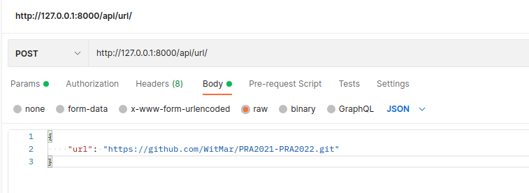

# Uruchomienie aplikacji

`docker-compose up --build`

# Wymagane pliki środowiskowe

<ul>
    <li>root/.env</li>
    <li>backend/.env</li>
    <li>postgres/.env</li>
</ul>

# Dostepne sa dwa endpointy

<ul>
<li>/api/url/ - przyjmuje dict np.: {"url": "https://github.com/WitMar/PRA2021-PRA2022.git"} w body</li>
<li>/api/zip/ - przyjmuje zip z repo (narazie pojedynczy plik)</li>
<li>/api/merged/ - uruchamia proces tworzenia raportu ze scalonych autorów/emaili</li>
<li>report/:{repo_name}/ - zwraca raport gotowy do wyświetlenia </li>
</ul>

## Przykladowe zapytanie



## Przykladowy response(fragment)

```{
    "repo_name": "PRA2021-PRA2022",
    "HEAD": {
        "commits": [
            {
                "author": "marcin witkowski",
                "branch": "HEAD",
                "date": "2020-10-18T16:24:11+02:00",
                "message": "Initial commit",
                "changes": {
                    "pom.xml": {
                        "insertions": 11,
                        "deletions": 0,
                        "lines": 11
                    },
                    "src/main/java/introduction/HelloWorld.java": {
                        "insertions": 8,
                        "deletions": 0,
                        "lines": 8
                    }
                }
            },
            {
                "author": "marcin witkowski",
                "branch": "HEAD",
                "date": "2020-10-18T16:58:41+02:00",
                "message": "set up maven compilation version",
                "changes": {
                    "pom.xml": {
                        "insertions": 4,
                        "deletions": 0,
                        "lines": 4
                    }
                }
            },
            {
                "author": "marcin witkowski",
                "branch": "HEAD",
                "date": "2020-10-18T17:00:15+02:00",
                "message": "add resource file",
                "changes": {
                    "src/main/resources/test": {
                        "insertions": 1,
                        "deletions": 0,
                        "lines": 1
                    }
                }
            },
            {
                "author": "marcin witkowski",
                "branch": "HEAD",
                "date": "2021-10-03T17:54:27+02:00",
                "message": "Zmiana komunikatu",
                "changes": {
                    "src/main/java/introduction/HelloWorld.java": {
                        "insertions": 1,
                        "deletions": 1,
                        "lines": 2
                    }
                }
            },
            {
                "author": "marcin witkowski",
                "branch": "HEAD",
                "date": "2021-10-03T18:24:04+02:00",
                "message": "Master",
                "changes": {
                    "src/main/java/introduction/HelloWorld.java": {
                        "insertions": 0,
                        "deletions": 8,
                        "lines": 8
                    },
                    "src/main/resources/test": {
                        "insertions": 0,
                        "deletions": 1,
                        "lines": 1
                    }
                }
            }
        ],
        "authors": [
            "marcin witkowski"
        ]
    },
}
}
```

## Struktura bazy danych

<ul>
<li>Repositories</li>
    <ul>
        <li>repo_name = CharField(max_length=200)</li>
    </ul>

<li>Authors</li>
    <ul>
        <li>name = CharField(max_length=200)</li>
        <li>email = EmailField(unique=True)</li>
        <li>repository = ForeignKey(Repositories, on_delete=CASCADE)</li>
    </ul>

<li>Branches</li>
    <ul>
        <li>name = CharField(max_length=200)</li>
        <li>commits_count = IntegerField()</li>
        <li>repository = ForeignKey(Repositories, on_delete=CASCADE)</li>
    </ul>

<li>Commits</li>
    <ul>
        <li>author = ForeignKey(Authors, on_delete=CASCADE)</li>
        <li>branch = ForeignKey(Branches, on_delete=CASCADE)</li>
        <li>date = DateTimeField()</li>
        <li>message = CharField(max_length=500)</li>
        <li>edited_files = CharField(max_length=1000)</li>
    </ul>
<li>Changes</li>
    <ul>
        <li>commit = ForeignKey(Commits, on_delete=CASCADE)</li>
        <li>file_name = CharField(max_length=200)</li>
        <li>insertions = IntegerField()/li>
        <li>deletions = IntegerField()</li>
        <li>lines = IntegerField()</li>
    </ul>
</ul>
